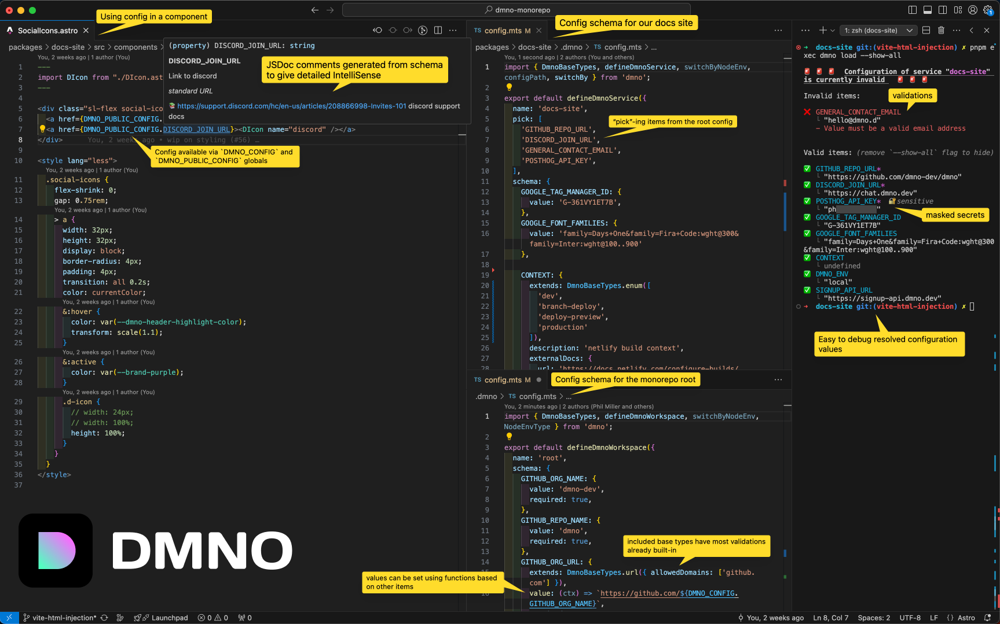

# DMNO [](https://www.npmjs.com/package/dmno)

>Full-stack configuration & secrets.
>Batteries included.



DMNO is a full-stack configuration tool that provides validation, leak detection/prevention, and type-safety for your environment variables and secrets. There are some features that will benefit you if you're in a monorepo, but DMNO is designed to work in any project.

To get started with DMNO, run: 
  
```bash
npx dmno init
```

Check out the [docs](https://dmno.dev/docs) for more information on [plugins](https://dmno.dev/docs/plugins/overview/), [integrations](https://dmno.dev/docs/integrations/overview/), and [platforms](https://dmno.dev/docs/platforms/overview/) we support.

> If you notice anything weird or there's a feature you would like to see, let us know here on [GitHub](https://github.com/dmno-dev/dmno/issues/new/choose) or on [Discord](https://chat.dmno.dev).


## Contributing

If you're interested in contributing, see [CONTRIBUTING.md](CONTRIBUTING.md) for more information.

