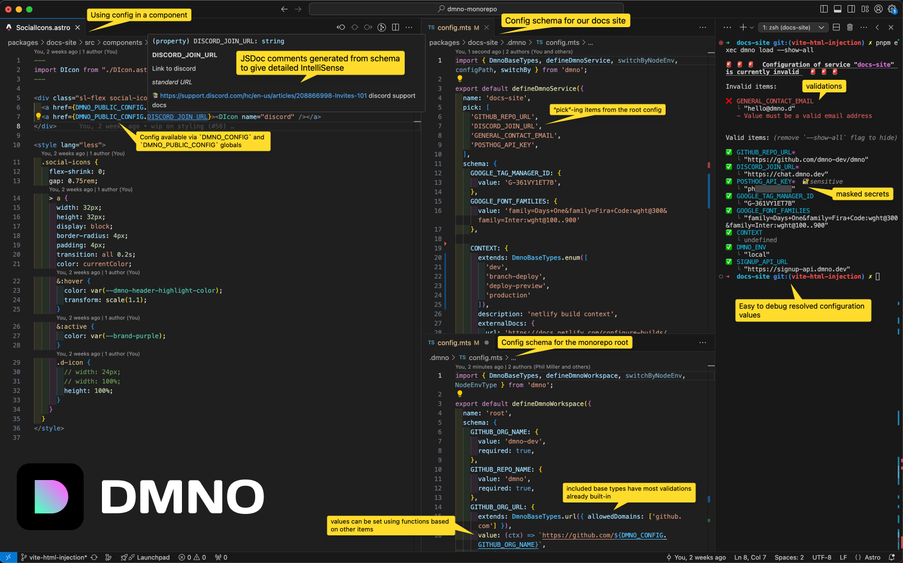

*Astro CTO Matthew Phillips presenting Astro's new `astro:env` feature at Astro Together in Montreal.*

Configuration in Astro has improved drastically in recent weeks. We launched DMNO, including our [Astro integration](/docs/integrations/astro/), and shortly after Astro launched their official (experimental) `astro:env` feature in version [`4.10`](https://astro.build/blog/astro-4100/). We were very excited to see this on the main stage at [Astro Together in Montreal](https://astro.build/blog/astro-together-montreal/) (see above ^^), and to talk with the core team about how we can work together to make configuration in Astro even better. There's already some great [cross-pollination](https://github.com/withastro/roadmap/discussions/956) happening, and we're excited to see where it goes.

We're really glad to see Astro taking configuration seriously, and we're excited to see how the community uses these new tools to build even better sites. That said, we do think DMNO has some unique advantages that make it a great choice for many Astro projects, especially if you want to share config among other services. Here's a quick overview of what DMNO can do for you:

### Key Features

**Onboarding:**

- **Automatic initialization:**
Using `dmno init`, DMNO detects your Astro setup and automatically installs necessary packages and updates your config files.

- **Easy scaffolding:**
DMNO scaffolds your config schema based on existing `.env` files, making it easier to manage environment variables.

- **Accessible config objects:**
DMNO injects configuration globally into your application, offering `DMNO_CONFIG` and `DMNO_PUBLIC_CONFIG` for sensitive and non-sensitive data, respectively.

**Security:**

- **Client and server security:**
DMNO ensures that only non-sensitive config is accessible on the client side, and augments security by detecting accidental leaks.

- **`console.log` redaction:**
DMNO optionally redacts sensitive data from `console.log` output, ensuring that your secrets are never exposed or persisted in your logs. 

- **HTTP interception:**
DMNO optionally intercepts HTTP requests to prevent sensitive data from being sent to third-party services. e.g., Only send your Stripe key to `api.stripe.com`.

- **Store secrets securely:**
 Use plugins to store your sensitive config items in an encrypted vault, or remotely in 1Password.

**Flexibility:**

- **Static and dynamic config:**
Additional control over static (build-time) and dynamic (runtime) config ensures flexibility and efficiency in your application.

- **Share config items in your monorepo:**
 Access shared schema items from anywhere in your repo.

### Additional advantages

- **Use env vars in astro config:**
  Access env vars directly in your `astro.config.*` files.
  
- **Inline Script Tags:**
  Workaround for using config within inline scripts by utilizing attributes.

### Get started

DMNO provides the most powerful way to manage configuration in Astro projects, all while enhancing security, and improving developer experience. 

All it takes is `npx dmno init` 🎉

For more detailed information, visit the [DMNO Astro Integration Guide](https://dmno.dev/docs/integrations/astro/).
