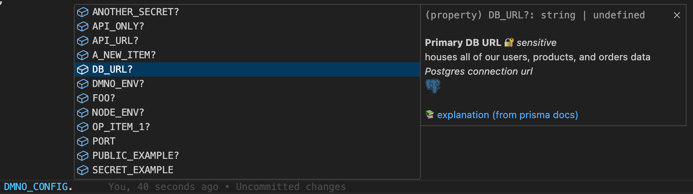

## Introduction

If you’ve ever felt that sinking feeling when dealing with sensitive environment variables then this post is for you. We’ll show you how we can take them from a ‘set it and forget it until it comes back to haunt you’ concept to something that will provide confidence and safety throughout your entire development workflow. 

*But first, a short history lesson.*


### A very brief history of environment variables

Believe it or not, the humble environment variable (env var) dates back all the way to Unix Version 7 in 1979! They’ve been around longer than DOS and Windows, which quickly adopted their own notion of env vars after they came onto the scene in the 80s. Env vars exist to provide arbitrary values to running processes, and their children. They are the de facto method for storing application configuration such as secrets, feature flags, credentials, etc. 

They have been largely unchanged since they appeared 46 (!) years ago. One more recent advancement was the introduction of the `.env` file by Heroku in 2012, used to populate their Config Vars, which were then injected into the environment during deployment. These `.env` files were also a means of conforming to the [12 Factor](https://12factor.net/) standard that Heroku’s engineering team championed. The `.env` file did a lot to help but it also created some unforeseen challenges. 


### Why your .env is failing you

Because `.env` became the standard, it has also devolved into a pseudo-onboarding tool. Despite knowing it’s dangerous from a security perspective, it is extremely common to share a `.env` file full of secrets with the new hire on Slack. Even when sharing values securely, it is often a manual one-time process, and that  `.env.example` file which serves as a template and documentation for required config can quickly get out of sync with the real `.env` that it’s trying to mirror. 

`.env` has also become an incomplete picture of what configuration is. Because of the headaches involved with collaboration, `.env` typically contains only sensitive or secret items, and it means the non-sensitive items tend to live elsewhere in the code. Doesn’t it seem odd that you get two keys from Stripe, but the public and private keys are defined in two different locations? 

Finally, because of the nature of env vars, everything is stored as a string. This means that it’s often left to the developer to coerce values into their actual types (number, object, arrays, etc), to validate that values are populated and valid, and ideally to have type-safety for those values.

It’s not to say that there aren’t a whole host of tools out there to deal with this, but what that typically looks like is cobbling together several of them in hopes that they solve all of the above. In a larger project, this often means using an entirely different setup for each part of your stack, with no easy way to share config across different parts of your system.

Not to mention, that even in a good-enough `.env` setup, chances are it’s still sitting on your machine in plaintext!

*There has to be a better way, right?!*


## A more modern approach

After speaking with a cross-section of development teams across many stages and sizes, we realized that most of them were storing sensitive information like API keys and other credentials in 1Password and then copy and pasting those into `.env` files, or into the GUIs on their platform of choice for deployments. And although 1Password has a few developer-centric methods for managing the items stored in your vaults (e.g., SDKs, CLI), actually using that in your code is an exercise left to the reader. 

So given the flexible nature of DMNO, it was an obvious choice for one of our first plugins to allow the retrieval of items from 1Password. In addition the wealth of features DMNO already provides, with our 1Password plugin you can also: 

* Secure your entire existing `.env` files in a single 1Password item - i.e., secure the entire file with a single copy and paste
* Segment config into multiple vaults per environment, service, or however makes sense for your application
* Use the 1Password app’s biometric unlock to secure your secrets when developing locally
* Or: use with no dependencies other than the plugin via a service account token - using the 1Password SDK under the hood

If your team is using 1Password today and duplicating secrets or writing a bunch of custom code just to sync them, then DMNO will make your life much easier and more secure. 

To get started see our [1Password plugin guide](https://dmno.dev/docs/plugins/1password/).  

Or read on for a full tutorial. 


First let’s assume you have `.env` file that looks something like this: 

```bash
API_SERVER_URL=”api.myserver.com”
API_SERVER_PORT=”4392”
DB_USER=”prod-user”
DB_PASS=”prod-secret”
DB_PORT=”5432”
DB_URI=”mydbserver.com”
DB_CONNECTION_STRING=”pgsql://$DB_USER:$DB_PASS@$DB_URI:$DB_PORT”
GITHUB_TOKEN=”ijfdpaojifdipajifjdp2144oajfpijapijfdoiaj123opiijfdiopiajf”
STRIPE_TOKEN=”pk_ipjfdioajp55fidjiaopjiofd_ijjpofd14oiajfpodj” 
```

Chances are this most resembles your production environment and you’ve got a completely different version locally, although some of the individual items might be the same. We’ll address this later, but just note that this .env *drift* is sort of inevitable with setups like this. 


## Setup

A note on requirements: 

* You’ll need Node (>20) 
* A js package manager (npm, pnpm, etc)
* Linux/OSX/WSL


### 1Password

DMNO’s integration with 1Password makes use of Service Accounts. So you’ll need to create one that has access to the Vault that will hold your sensitive config items. 

******INSERT SCREENSHOT******

> Note that you **cannot** change the access of a particular service account after it has been created. 

For the purposes of this tutorial, let’s create a new Vault called **DMNO Production Secrets**, and create a service account that has access to only this vault. See the 1Password docs for information on creating Vaults and Service Accounts.


### The local option

Since the easiest way to interact with 1Password on your local machine is their desktop application, let’s get that set up. This has the added advantage of allowing you to use biometric authentication with our plugin. **You only need to do this if you want to use the local application with the integration while working your local machine. If you just want to use service accounts, you can skip this step. **

If you haven’t already, do the following: 

* Install 1Password’s desktop application
* Install the 1Password CLI (used to communicate with the application locally)
* Turn on the CLI integration in the Developer Settings (see screenshot below)


*Check the ‘Integrate with 1Password CLI` box*


### DMNO

In the root of your project, or the package/service in question, run the following: 

```bash
npx dmno init 
# follow the prompts and after that is all complete
npm add @dmno/1password-plugin
```

After all of that you should have one, or more. `.dmno/` folders. We’ll assume a single folder for now for brevity’s sake. 

In your `.dmno/config.mts`, let’s add the code for the 1Password plugin: 

```typescript
import { OnePasswordDmnoPlugin, OnePasswordTypes } from '@dmno/1password-plugin';
// token will be injected using types by default
const onePassSecrets = new OnePasswordDmnoPlugin('1pass', {
  fallbackToCliBasedAuth: true,
});

export default defineDmnoService({
  name: ‘my-service’,
  schema: {
    OP_TOKEN: {
      extends: OnePasswordTypes.serviceAccountToken,
      // NOTE - the type itself is already marked as sensitive 🔐
    },
  },
});

```

In this code we’re importing the required parts from our plugin, creating an instance of the plugin and adding a schema item, in this case a sensitive one, that holds our service account token. You’ll notice we’re not explicitly passing the token to the plugin when we instantiate it. This is because with DMNO’s smart type system we know that we have a `serviceAccountToken` available to us so we can automatically inject it. 

Additionally, because we have `fallbacktoCliBasedAuth` enabled, when no service account token is found, we’re relying on the CLI to interface with the 1Password desktop app – bypassing the service account entirely. This allows us to avoid passing around any auth tokens and use the additional biometric security provided by 1Password on your local machine. In a deployed environment, like in CI/CD, it will still use the service account you set up. 


### What about blob?

Let’s return to our blob-style `.env` file and secure it with 1Password. With everything that we’ve set up this should mean just a single copy paste and a few updates to our DMNO schema.

In the **DMNO Production Secrets** vault that you created, create a new Secure Note, and give it an appropriate name, such as “Prod secrets”. 

In that item create a new multi-line text field, and change the label of that field to match your service name - which will be the “name” field of your package.json file or the `name` you used in your `config.mts`. In the example above, this is `my-service`. If you’ll only ever have a single service you can use the special `_default` name. 

Now paste in the contents of your `.env` file from above. 


*Your vault should look something like this*

### Wire it up

Now all that’s left is to update our schema items to fetch from 1Password. 

```typescript
import { OnePasswordDmnoPlugin, OnePasswordTypes } from '@dmno/1password-plugin';
// token will be injected using types by default
const onePassSecrets = new OnePasswordDmnoPlugin('1pass', {
  fallbackToCliBasedAuth: true,
  envItemLink: ‘https://start.1password.com/open/i?a=I3GUA2KU6BD3IJFPDAJI47QNBIVEV4&v=wpvutzohxcj6kwstbzpt3iciqi&i=ti3v3j3fjdaipofj4ejlr373vdivxi&h=mydomain.1password.com’
});

export default defineDmnoService({
  name: ‘my-service’,
  schema: {
    OP_TOKEN: {
      extends: OnePasswordTypes.serviceAccountToken,
      // NOTE - the type itself is already marked as sensitive 🔐
    },
    // include as many items as you want to fetch from your 1Pass .env item
    // we’ll include two for brevity’s sake
    GITHUB_TOKEN: {
      required: true,
      sensitive: true,
      value: onePassSecrets.item(),
    },
    STRIPE_TOKEN: {
      required: true,
      sensitive: true,
      value: onePassSecrets.item(),
    },
  },
});

```

First, we add the `envItemLink` to the plugin initialization which tells it to look in a particular item for the env blobs. Then, for each schema item (wired up via the `.item()` method) it will look in the `my-service` entry for a key that matches and securely load the value. Finally, we’ve added the `required` and `sensitive` so that DMNO can use appropriate validation and security rules for the items. 


### Improved DX

Now in your application code you can use the DMNO_CONFIG globals to reference config items and benefit from improved type-safety and Intellisense. 

```typescript
const GH_TOKEN = process.env.GITHUB_TOKEN;
const GH_TOKEN = DMNO_CONFIG.GITHUB_TOKEN;

```



And, naturally, you will also benefit from all the additional features that DMNO provides including: validation, coercion, leak prevention and detection, and log redaction – to name a few. 


## What next?

To recap, you now have env vars stored securely in 1Password. You’re using biometric authentication when developing locally and service accounts everywhere else. Your items are now type-safe, validated, and kept in sync automatically. 

Things are feeling good. 😎

Next, you may want to:

* break out your blobs into individual items in 1Password ([read more](https://dmno.dev/docs/plugins/1password/#using-specific-1password-items)).
* have multiple vaults with differing levels of access (e.g., one for dev and one for prod). ([read more](https://dmno.dev/docs/guides/secret-segmentation/))
* Add further validation and documentation to the individual items ([read more](https://dmno.dev/docs/guides/incremental-adoption/))

:::tip[Feedback]
Is there something that we missed or another feature you’d like to see? 

Drop us a line on [Discord](https://chat.dmno.dev), your feedback is important to us. 
:::


