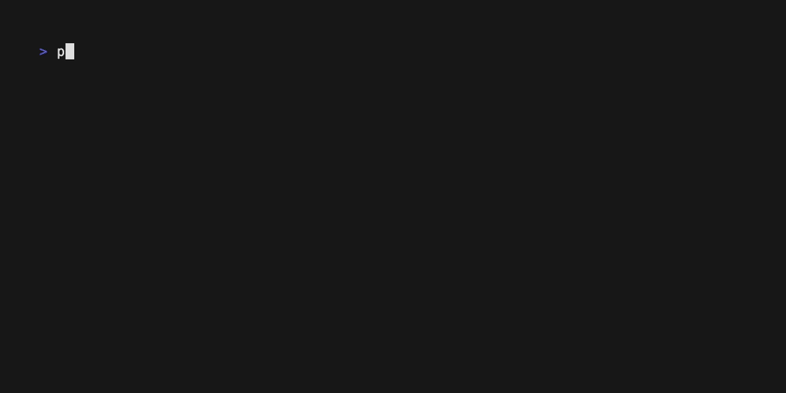

import { Steps, FileTree, Code } from '@astrojs/starlight/components';
import TabbedCode from '@/components/TabbedCode.astro'; 


<Steps>

1. ### **Setup `dmno` in your project**

    Run this command in the root of your project:
    <TabbedCode dynamicExec="dmno init" />

    

    This will create a `.dmno` folder in the root of your project with a `config.mts` file. If in a monorepo, any additional services of your choice will get their own `.dmno` folders. It will produce a file tree that looks something like this:

    <FileTree>
    - / (root of your project)
      - .dmno (your workspace config)
        - **config.mts**
      - packages
        - my-package
          - .dmno 
            - **config.mts** (config for my-package service)
        - another-package
          - .dmno
            - **config.mts** (config for another-package service)

    </FileTree>

2. ### **Start the development server**

    This will give you instant feedback while you author your config schema.
    <TabbedCode command="dmno dev" />

    

3. ### **Write your schema**

    The config schema and other settings live in the `.dmno/config.mts` files. Defining each item with a description, [`required`](/docs/guides/schema/#validations--required-config), and [`sensitive`](/docs/guides/schema/#secrets--security) is a great first step. You can then improve your schema over time, adding validations, and setting values from within the schema itself.

    Check out the [schema guide](/docs/guides/schema/) for full details.

4. ### **Install framework specific integrations**

    We provide [drop-in integrations](/docs/integrations/overview/) for many popular frameworks, and more are in the works. `dmno init` is smart enough to install the relevant integrations for each service. You can also read more about each integration on their respective [pages](/docs/integrations/overview/).

5. ### **Use `DMNO_CONFIG` to access your config** 

    We recommend migrating to `DMNO_CONFIG` as it provides helpful improvements like TypeScript autocompletion and IntelliSense.
      
    For example:
    ```diff lang="ts" ins="DMNO_CONFIG."
      // 😿 still works, but no type-safety, and will be a string
      if (!process.env.SOME_NUMBER) {
        throw new Error('Missing SOME_NUMBER env var');
      }
      const myConfigNum = parseFloat(process.env.SOME_NUMBER);
      
      // 🎉 easier, safer, full type-safety
      const myConfigNum = DMNO_CONFIG.SOME_NUMBER;
      const IS_PROD = DMNO_CONFIG.NODE_ENV === 'production';
    ```
    {/* TODO maybe include gif of IntelliSense */}

    You _could_ continue to use `process.env`/`import.meta.env` to access your config and still benefit from DMNO's validation logic. But, `DMNO_CONFIG` gives you the full benefits of DMNO.

    :::note[Secrets & DMNO_PUBLIC_CONFIG]
    While building code for the browser or another less-secure context, you can use the `DMNO_PUBLIC_CONFIG` object - it does not contain any items that are marked as `sensitive: true` in your schema
    :::

</Steps>


