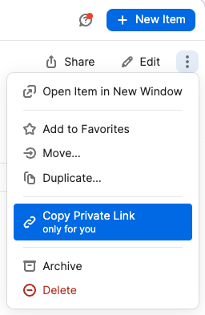
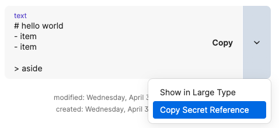

import { Steps, Icon } from '@astrojs/starlight/components';
import TabbedCode from '@/components/TabbedCode.astro';

DMNO's 1Password plugin allows you to securely access your stored secrets in 1Password. This plugin uses the 1Password CLI by means of a [Service Account](https://developer.1password.com/docs/service-accounts). It is compatible with any account type. Note that rate limits vary by account type, you can read more about that in the [1Password Developer documentation](https://developer.1password.com/docs/service-accounts/rate-limits/).

## Installation

Install the package

<TabbedCode packageName="@dmno/1password-plugin" />

:::tip
Install in the root if it's going to be shared, or in specific services' directory otherwise.
:::

-----

Initialize the plugin in the root (or service if not shared)


```typescript
import { OnePasswordDmnoPlugin, OnePasswordTypes } from '@dmno/1password-plugin';

const OnePassBackend = new OnePasswordDmnoPlugin('1pass/prod', {
  token: configPath('OP_TOKEN'),
  // if using an item link, we will assume the config is in an item called `env`
  envItemLink: 'https://start.1password.com/open/i?a=I3GUA2KU6BD3FBHA47QNBIVEV4&v=ut2dftalm3ugmxc6klavms6tfq&i=n4wmgfq77mydg5lebtroa3ykvm&h=dmnoinc.1password.com',
});

// OR

const OnePassBackend2 = new OnePasswordDmnoPlugin('1pass/prod', {
  token: configPath('OP_TOKEN'),
  // using a reference to the actual item
  envItem: '"op://dev test/n4wmgfq77mydg5lebtroa3ykvm/env"',
});

export default defineDmnoWorkspace({
  schema: {
    OP_TOKEN: {
      extends: OnePasswordTypes.serviceAccountToken,
      // NOTE - the type itself is already marked as secret
    },
  },
});
```
Note, we're giving the plugin an alias (in this case '1pass/prod') so we can refer to it in other services or in the CLI. This is useful if you have multiple vaults or service accounts.

If you don't have an existing service account or vault, we'll go over that in the next section.

:::tip
For more on 1Password security, see their best practices for [CLI](https://developer.1password.com/docs/cli/best-practices/) and [business accounts](https://support.1password.com/business-security-practices/#access-management-and-the-principle-of-least-privilege).
:::


------------

## Setting up your vaults and service account(s)

:::caution
INSERT GIF/IMAGE OF 1PASSWORD VAULTS AND SERVICE ACCOUNTS
:::

<Steps>

1. **Create a vault** in your 1Password account. This is where you'll store your secrets. You can create multiple vaults for different environments or services. [link](https://support.1password.com/create-share-vaults/#create-a-vault)

2. **Create a service account** in your 1Password account. This is a separate account that has access to the vault(s) you created. You can create multiple service accounts for different environments or services. [link](https://developer.1password.com/docs/service-accounts/get-started/)

3. **Add the service account to the vault**. This is done in the 1Password web interface. You can add multiple service accounts to a single vault. [link](https://developer.1password.com/docs/service-accounts/manage-service-accounts/#manage-access)

</Steps>

:::tip
Consider how you want to organize your vaults and service accounts. You might have a single vault for all your secrets (per environment), or you might have separate vaults for each service (and environment). At a minimum, DMNO recommends having separate vaults for production and non-production environments.
:::

------

## Add your items

DMNO supports a few different ways to reference items in 1Password. You can use a direct link to the item, the item's UUID, or a reference to the item in the format `op://vaultname/itemname/path`. We also support, storing the items in one large blob (like your existing `.env` file). This allows you to easily transition from a `.env` file to 1Password as a secure vault.

### Using a env blob

If you have a single item that contains all your secrets, you can reference that item in your config. In the example below, we're referencing an item called `env` that contains all our secrets and matching based on the key, in this case `ITEM_PULLING_FROM_ENV_BLOB_ITEM`.

```ts
{
  // from blob env
  ITEM_PULLING_FROM_ENV_BLOB_ITEM: {
    value: OnePassBackend.item(),
}
```

You can also reference a specific item in 1Password, in the following three ways:

```ts
{
  // ...  
  // from private link
  ITEM_WITH_LINK: {
    value: OnePassBackend.itemByLink('https://start.1password.com/open/i?a=I3GUA2KU6BD3FBHA47QNBIVEV4&v=ut2dftalm3ugmxc6klavms6tfq&i=n4wmgfq77mydg5lebtroa3ykvm&h=dmnoinc.1password.com', 'somepath'),
  },
  ITEM_WITH_IDS: {
    value: OnePassBackend.itemById('vaultUuid', 'itemUuid', 'somepath'),
  },
  ITEM_WITH_REFERENCE: {
    value: OnePassBackend.itemByReference('op://vaultname/itemname/path'),
  },
}
```

 

:::tip
You can find the private link by clicking the 3 dots on the item in the 1Password interface and selecting `Copy Private Link`. The secret reference for invidivual items can be found by clicking on the down arrow icon on the item and selecting `Copy Secret Reference`.
:::


