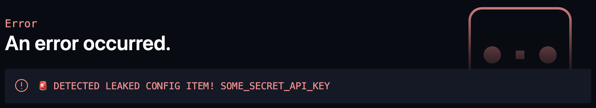

--- 
title: Astro Integration
description: Use DMNO to manage your Astro app's environment variables for static, hybrid, and server-side rendering.
npmPackage: "@dmno/astro-integration"
---

import AstroLogo from "~icons/logos/astro";

import TabbedCode from '@/components/TabbedCode.astro';
import BugReportLink from '@/components/BugReportLink.astro';

At DMNO we _love_ [Astro](https://astro.build/). This very site is built with it! That's why we're very excited to make it easier and safer to use environment variables in all of your Astro-powered projects, whether it's on the client or the server.

## Setup

### Initialize your Astro integration

Using [`dmno init`](/docs/reference/cli/init/) will automatically detect that you are using Astro and install the necessary packages and configuration for you.

<TabbedCode dynamicExec="dmno init" />

>Skip to [Configure...](#configure-your-environment-variables) once this is complete.

:::note
If you run into any issues, feel free to <BugReportLink label='integrations/astro'>report them to us on GitHub</BugReportLink> and try the manual installation steps below.
:::

#### Manual install instructions

If you prefer, you can install the `dmno` and `@dmno/astro-integration` packages manually:

<TabbedCode packageName="@dmno/astro-integration dmno" />

Update your `astro.config.mjs` - import the plugin, and add to `defineConfig`: 

```diff lang="js" title="astro.config.mjs" ins="dmnoAstroIntegration()"
import { defineConfig } from 'astro/config';
+import dmnoAstroIntegration from '@dmno/astro-integration';

export default defineConfig({
  // ...
  integrations: [dmnoAstroIntegration()],
});
```

### Configure your environment variables

`dmno init` will scaffold out the `schema` in your `config.mts` files based on any existing `.env` files and references to `process.env`/`import.meta.env` found within your codebase. See our [Schema Guide](/docs/guides/schema/) for the specifics of how to author additional updates to your DMNO `schema`.

## Accessing config

DMNO globally injects your config into your application. You can access it via:
- `DMNO_CONFIG` - includes _all_ of your config items
- `DMNO_PUBLIC_CONFIG` - includes only items not marked with `sensitive: true`

You can now access these with full type-safety and autocompletion just about everywhere in your code - including astro components, vue/react/etc, mdx files, even your `astro.config.*`!

:::tip[Why globals?]
It's really no different than using `process.env` or `import.meta.env` - but by using our own variables, we can provide a more consistent experience and sprinkle some extra magic on top ✨
:::

### Protecting secrets from leaking

In theory, you should only access `DMNO_PUBLIC_CONFIG` on the _client_, and you can access both `DMNO_CONFIG` and `DMNO_PUBLIC_CONFIG` on the server.

Sounds easy, right? Except in a world of hybrid client/server rendering and rehydration, and when you may actually need sensitive config during a server-side render, it can be hard to keep track of what is getting rendered where.

So, we make it easy for you:

- Within the browser/client, you only have access to `DMNO_PUBLIC_CONFIG` and if you try to access `DMNO_CONFIG`, we'll throw a helpful error 🛑
- We detect leaked secrets in built JS code and server-rendered responses, just in case you leaked a secret into ANYTHING getting sent over the wire (opt-in via `preventClientLeaks` service setting)
- We redact sensitive data from logs (opt-in via `redactSensitiveLogs` service setting)
- We intercept HTTP requests if you send sensitive config somewhere it's not supposed to go (opt-in via `interceptSensitiveLeakRequests` service setting)


_an example of our middleware in action_

Check out the [security guide](/docs/get-started/security/) for more details on our opt-in security features.

### Static vs dynamic config

DMNO gives you explicit control over how your config items are treated - whether they will be replaced into your bundled code at build time (i.e., static), or reloaded at boot time (i.e., dynamic). See the [dynamic config guide](/docs/guides/dynamic-config/) for more details.

Client-side loading of dynamic config is automatically enabled if you are not using `output: 'static'` mode and you have non-sensitive dynamic config items in your schema. It will be fetched on-demand, so if you don't use those items on the client, that's also fine. This integration will automatically inject the API route required to fetch public+dynamic config.

Additionally, this integration throws an error during `astro build` if you try to use a dynamic config item during a pre-render of any static page/endpoint - regardless of the [output mode](https://docs.astro.build/en/basics/rendering-modes/#server-output-modes) you are using.

No matter what, dealing with config in a hybrid server/client rendering setup is confusing and full of footguns, so we do our best to protect you 🛡️ and make it as easy as possible.

---

## Common recipes

### Using env vars within `astro.config.*`
It's often useful to be able to access configuration / env vars within your Astro config. Without DMNO, it's a bit awkward, but DMNO makes it dead simple - in fact it's already available! Just reference config vars via `DMNO_CONFIG.SOME_ITEM` like you do everywhere else.

In most Astro projects, it should just work, but if you are seeing type errors about `DMNO_CONFIG` not existing, you can add a triple slash reference to the generated types. For example:

```diff lang="ts" title="astro.config.ts"
+/// <reference types="./.dmno/.typegen/global.d.ts" />
import { defineConfig } from 'astro/config';
// ...
```
see our [TypeScript guide](/docs/guides/typescript/) for more details.


### Injecting config into markdown files

Markdown files are processed by Astro but treated as pure content without evaluating any javsascript. So if you need to inject any DMNO_CONFIG values, you'll need to use MDX instead.

See [@astrojs/mdx integration](https://docs.astro.build/en/guides/integrations-guide/mdx/)

Then you need to use JSX within your markdown content. For example:

```mdx
# Header with config item { DMNO_PUBLIC_CONFIG.SOME_VAR }
```

For links, you'll need to use the html/jsx version rather than a markdown style link:
```diff lang="mdx" ins={"🥳 Use HTML/JSX style links": 1} del={"🥵 Markdown style links dont work": 3}
+
+Join us on our <a href={DMNO_PUBLIC_CONFIG.DISCORD_JOIN_URL}>Discord</a>

-Join us on our [Discord](DMNO_PUBLIC_CONFIG.DISCORD_JOIN_URL)
-Join us on our [Discord]({DMNO_PUBLIC_CONFIG.DISCORD_JOIN_URL})
-Join us on our [Discord]({ DMNO_PUBLIC_CONFIG.DISCORD_JOIN_URL })


```


### Injecting config into inline script tags
Another case where Astro may not process the code you write and inject DMNO_CONFIG is within the body of an inline script. Attributes do work though, so here is one workaround you can use:

**GoogleAnalytics.astro**
```diff lang="jsx"
<script
  type="text/partytown"
  async
-  src="https://www.googletagmanager.com/gtag/js?id=G-12345"
+  src=`https://www.googletagmanager.com/gtag/js?id=${DMNO_PUBLIC_CONFIG.GOOGLE_TAG_MANAGER_ID}`
></script>

<script
  type="text/partytown"
+  define:vars={{ gtmid: DMNO_PUBLIC_CONFIG.GOOGLE_TAG_MANAGER_ID }}
>
  window.dataLayer = window.dataLayer || [];
  function gtag() {
    dataLayer.push(arguments);
  }
  gtag("js", new Date());
  // we can reference the attributes of the current script tag
-  gtag("config", "G-12345");
+  gtag("config", gtmid);
</script>
```

