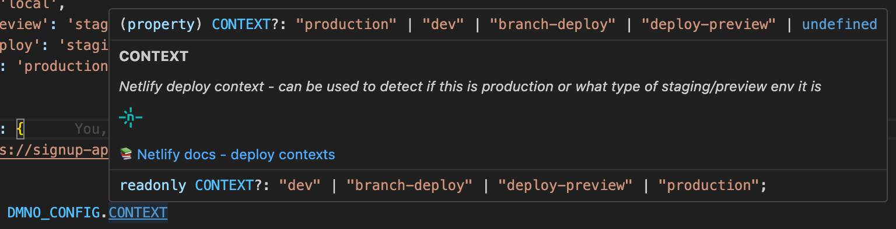

--- 
title: Platforms overview
description: "Use DMNO with your favorite deployment platforms and tools including: Netlify, Vercel, Render.com, and more."
---

We publish first-party packages to help you use DMNO with your favourite deployment platforms.

In many cases, you may not need to do anything special, but our platform-specific config schemas will give you a nicer experience using the environment variables that your platform may inject while running your code. For example:

### [Netlify](/docs/platforms/netlify/) 

Package: `@dmno/netlify-platform`

Includes:
- Config schema of env vars injected by the Netlify platform
- Netlify-specific data types
- Netlify build plugin

### [Vercel](/docs/platforms/vercel/) 

Package: `@dmno/vercel-platform`

Includes:
- Config schema of env vars injected by the Vercel platform
- Vercel-specific data types

### Next up

We're already working on more platform integrations, but we'd love to hear from you which platforms to tackle next!

On the roadmap:
- Cloudflare
- Fly.io
- Heroku
- Render.com
