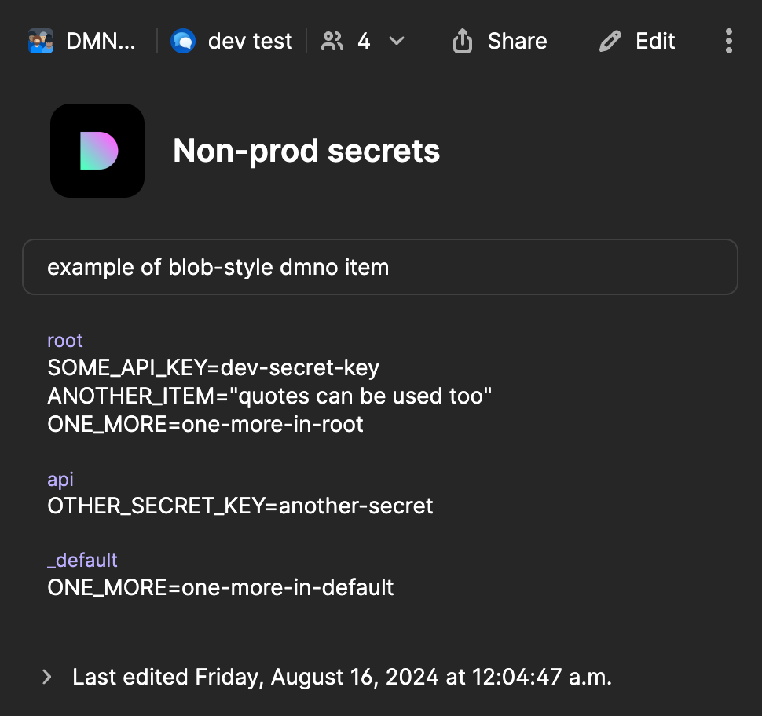

import { Steps, Icon } from '@astrojs/starlight/components';
import TabbedCode from '@/components/TabbedCode.astro';

DMNO's [1Password](https://1password.com/) plugin allows you to securely access your secrets stored in 1Password. This plugin uses their [JavaScript SDK](https://github.com/1Password/onepassword-sdk-js/) to authenticate using a [service account](https://developer.1password.com/docs/service-accounts). Additionally, for local development, you can opt-in to use your system-installed [1Password CLI](https://developer.1password.com/docs/cli/get-started/) and its [integration with the 1Password desktop app](https://developer.1password.com/docs/cli/get-started/#step-2-turn-on-the-1password-desktop-app-integration). This plugin is compatible with any 1Password account type (personal, family, teams, business), but note that [rate limits](https://developer.1password.com/docs/service-accounts/rate-limits/) vary by account type.

## Installation & setup

Install the package in the service(s) that will use config from 1Password.

<TabbedCode packageName="@dmno/1password-plugin" />

-----

After installation, you'll need to initialize the plugin in your dmno config and add a service 1password service account token into your config schema. You can explicitly wire the plugin up to the service account token if using multiple tokens at once, or it will be injected by default. It's ok if you have not created this service account yet - we'll do that in the next section.

```diff lang="ts" title='.dmno/config.mts'
+import { OnePasswordDmnoPlugin, OnePasswordTypes } from '@dmno/1password-plugin';

// token will be injected using types by default
+const onePassSecrets = new OnePasswordDmnoPlugin('1pass');

// or you can wire up the path explicitly
+const onePassSecrets2 = new OnePasswordDmnoPlugin('1passWithExplicitPath', {
+  token: configPath('..', 'OP_TOKEN'),
+});

export default defineDmnoService({
  schema: {
+    OP_TOKEN: {
+      extends: OnePasswordTypes.serviceAccountToken,
+      // NOTE - the type itself is already marked as sensitive 🔐
+    },
  },
});
```

:::tip[Plugin instance IDs]
You must give each plugin instance a unique id so we can refer to it in other services and the [`dmno` CLI](/docs/reference/cli/plugin/).

In this case we used `1pass`, but you can imagine splitting vaults and access, and having multiple plugin instances - for example `1pass/prod` for highly sensitive production secrets and `1pass/dev` for everything else.
:::

### Injecting the plugin in monorepo services
In a monorepo, you are likely managing secrets for multiple services. If you will be using the same service account(s) to access those secrets, you can initialize a plugin instance once in your root service as seen above, and then _inject_ it in child services. Note we must use that same id we set during initialization.

```typescript title='apps/some-service/.dmno/config.mts'
import { OnePasswordDmnoPlugin } from '@dmno/1password-plugin';

// 💉 inject the already initialized plugin instead of re-initializing it
const onePassSecrets = OnePasswordDmnoPlugin.injectInstance('1pass');
```


------------

## Setup vault & service account

If you already use 1password and your secrets live in a vault that holds other important passwords and info, you should create a new vault and move your secrets to it, because **the access system of 1password is based on vaults, not individual items**.

<Steps>

1. **Create a vault** in your 1Password account which will be used to hold your secrets. You can create multiple vaults to segment access to different environments, services, etc. This can be done using any 1password app, the web app, or the CLI. [link](https://support.1password.com/create-share-vaults/#create-a-vault)

2. **Create a new service account** and grant access to necessary vault(s). This is a special account used for machine-to-machine communication. This can only be done in the 1Password web interface. Be sure to copy the new service account token or save it in another vault. [link](https://developer.1password.com/docs/service-accounts/get-started/)
    :::note[Vault access set during creation only]
    Vault access rules cannot be edited after creation, so if your vault setup changes, you will need to create new service account(s) and update the tokens.
    :::

3. **Grant vault access to users/teams (optional)**. Your developers may need access to at least some of your vaults, especially if using the `op` cli based auth mentioned below. [link](https://support.1password.com/create-share-vaults-teams/#share-a-vault)

4. **Ensure vault service account access is enabled (optional)**. Each vault has a toggle to disable service account access _in general_. It is on by default, so you will likely not need to do anything. [link](https://developer.1password.com/docs/service-accounts/manage-service-accounts/#manage-access)

</Steps>

This service account token will now serve as your "secret-zero" - which grants access to the rest of your sensitive config stored in 1Password. It must be set locally (unless relying on cli-based auth) and in deployed environments. It is sensitive so we must pass in the value as an _override_ rather than storing it within the config. Locally this usually means storing it in your [`.env.local` file](/docs/guides/env-files/) and on a deployed environment you'll usually set it within some kind of UI, wherever you would normally pass in environment variables.

```diff title=".dmno/.env.local"
+OP_TOKEN=ops_abc123...
```

Note that the config path of `OP_TOKEN` is arbitrary and you can see how it was wired up from your config schema to the plugin input in the example above. If you are using multiple vaults and service accounts, you may have something more like `OP_TOKEN_PROD` and `OP_TOKEN_DEV`.

:::tip[Vault organization best practices]
Consider how you want to organize your vaults and service accounts, keeping in mind [best practices](https://support.1password.com/business-security-practices/#access-management-and-the-principle-of-least-privilege). At a minimum, DMNO recommends having a vault for highly sensitive production secrets and another for everything else.
:::


### Desktop app / CLI integration (optional)

During local development, you may find it convenient to skip the service account tokens and instead rely on your system's `op` CLI and its [integration with the 1Password desktop app](https://developer.1password.com/docs/cli/get-started/#step-2-turn-on-the-1password-desktop-app-integration). This means you will be connecting to 1Password as if you were using your local 1Password desktop application, including using its biometric unlocking features.

<Steps>
1. **Opt-in while initializing the plugin**
    ```diff lang="ts" title='.dmno/config.mts'
    const onePassSecrets = new OnePasswordDmnoPlugin('1pass/dev', {
      token: configPath('..', 'OP_TOKEN'),
    +  fallbackToCliBasedAuth: true,
    });
    ```

    _Of course you can also point to a `configPath` in your schema and toggle the opt-in based on some other logic if you'd like._

2. **Ensure the `op` CLI is installed**. [docs](https://developer.1password.com/docs/cli/get-started/)

3. **Enable the desktop app + CLI integration**. [docs](https://developer.1password.com/docs/cli/get-started/#step-2-turn-on-the-1password-desktop-app-integration)

4. **Run `op signin` to sign in on the CLI**. Ensure you are logged in to the correct account. You can run `op whoami` to see which account is currently connected to the CLI.
</Steps>

With this option enabled, if the resolved service account token is empty, we will call out to the `op` cli installed on your machine (it must be in your `$PATH`) and use the auth it provides. With the desktop app integration enabled, it will call out and may trigger biometric verification to unlock. It is secure and very convenient!

:::caution[Connecting as yourself]
Keep in mind that this method is connecting as _YOU_ who may have more access than a tightly scoped service account. Consider only enabling this method for a plugin instance that will be handling non-production secrets.
:::

------

## Add items to your schema

With the plugin initialized and access wired up, now we must update our config schema to connect specific config values to data stored in 1Password. DMNO supports a few different ways to reference items in 1Password:

### Using a `.env` blob

Managing lots of individual 1Password items and connecting them to your config can be a bit tedious. So, when getting started, we recommend storing multiple items together in a `.env` style text blob. Using this method, we'll have a single 1Password item that can have one text entry per service containing the `.env` blob and look up items by their key - similar to applying a `.env.local` file as overrides, except they are secured and shared via 1Password. This also makes it easier to migrate from passing around `.env` files.

<Steps>

1. **Create a new item within your vault**. Select `Secure Note` as the item type and be sure to give it a descriptive name (e.g., `Prod secrets`).

2. **Create a new field in the item**. Click `+ add more` and select `Text` to add a new multi-line text field. Change the default label of `text` to the [service name](/docs/guides/schema/#service-names) you want to store secrets for (e.g., `root`). You can also use the special name `_default` if you are only dealing with a single service.
    :::note[Multiple services]
    In a monorepo, you can initialize a single plugin instance in your root service and inject it into each child service. In this case, add a field for each service.
    :::
3. **Add your secrets to the text field** as if it was another `.env` file that would be loaded as overrides. For example:
    ```
    SOME_API_KEY=super-secret-key
    ANOTHER_ITEM="quotes work too"
    ```
    _You can also come back and do this later._

3. **Wire up plugin instance to the new item** using its _private link_. While viewing the item in the 1Password app, click the 3 dots in the top right and click `Copy Private Link`. As this link does not contain anything sensitive, we can use a static value as our plugin input.

4. **Update items in your config schema** to use the `.item()` value resolver for anything that will be stored in the linked 1Password item. When we resolve your config values, if a match is not found, it will result in a `ResolutionError` with helpful info about how to fix it.

</Steps>

Your dmno config should end up looking like this:

```diff lang="ts" title=".dmno/config.mts"
const onePassSecrets = new OnePasswordDmnoPlugin('1pass/prod', {
  token: configPath('..', 'OP_TOKEN'),
+  envItemLink: 'https://start.1password.com/open/i?a=I3GUA2KU6BD3FBHA47QNBIVEV4&v=ut2dftalm3ugmxc6klavms6tfq&i=n4wmgfq77mydg5lebtroa3ykvm&h=dmnoinc.1password.com',
});

export default defineDmnoService({
  schema: {
    OP_TOKEN: {
      extends: OnePasswordTypes.serviceAccountToken,
    },
+    SOME_API_KEY: {
+      sensitive: true,
+      value: onePassSecrets.item(),
+    }
  },
});
```

And your 1password item may look this:



<details>
  <summary>Key lookup details and example</summary>

  Values are looked up within the linked 1Password item using a simple convention. We expect to find a _text field_ within the item with a label set to the current [service name](/docs/guides/schema/#service-names). The contents of that item are parsed as a [`.env` file](https://dotenvx.com/docs/env-file), and we look up items using the config item key. If no match is found, we will also look in an additional field with the label `_default`.

  For example, in the item above, an item with the key `ONE_MORE` would fallback to the value in the `_default` field in any service that wasn't named `root`.
</details>


You can also override the key used to lookup the value in the `.env` blob. This can be useful if you need to save multiple values toggled by some other logic.

```typescript title=".dmno/config.mts"
export default defineDmnoService({
  schema: {
    SOME_API_SECRET: {
      sensitive: true,
      value: switchBy('APP_ENV', {
        // uses the default key of "SOME_API_SECRET"
        _default: onePassSecretsDev.item(),
        // uses overridden key
        staging: onePassSecretsDev.item('SOME_API_SECRET_STAGING'),
        // uses the default key but looking in a different 1pass item
        staging: onePassSecretsProduction.item(),
      }),
    },
  },
});
```

### Using specific 1Password items

If you already have lots of individual items in 1Password, or you just don't want to use the blob method, we provide several methods to wire up individual config items to specific values in 1Password. Note that while 1Password reference URIs (e.g., `op://vaultname/itemname/path`) are easier to use in some ways, they are based on field labels and are not stable, so the other methods are preferred.

```ts
export default defineDmnoService({
  schema: {
    // using item private link
    ITEM_WITH_LINK: {
      value: onePassSecrets.itemByLink(
        'https://start.1password.com/open/i?a=I3GUA2KU6BD3FBHA47QNBIVEV4&v=ut2dftalm3ugmxc6klavms6tfq&i=n4wmgfq77mydg5lebtroa3ykvm&h=dmnoinc.1password.com',
        'somefieldid',
      ),
    },
    // using UUIDs
    ITEM_WITH_IDS: {
      value: onePassSecrets.itemById('vaultUuid', 'itemUuid', 'somefieldid'),
    },
    // using item reference url
    ITEM_WITH_REFERENCE: {
      value: onePassSecrets.itemByReference('op://vaultname/itemname/path'),
    },
  },
});
```

:::tip[Where to find an item private link]
You can find the private link by clicking the 3 dots **on the item** in the 1Password interface and selecting `Copy Private Link`.
:::

:::tip[Where to find field IDs]
Field IDs are not easy to get from the 1Password UI. Luckily when the supplied field ID is not found, our error message includes a list of all the possible IDs in the item. Start with an empty string or a bogus ID like `"?"` and use the DMNO error message to find the right field ID.
:::

:::tip[Where to find an item reference]
The secret reference for invidivual fields within an item can be found by clicking on the down arrow icon **on the field** and selecting `Copy Secret Reference`.
:::

## Caching
In order to avoid rate limits and keep dev server restarts extremely fast, we heavily cache data fetched from external sources. After updating secrets in 1password, if the item has been cached, you'll need to clear the cache to see it take effect.

- Use the [`dmno clear-cache` command](/docs/reference/cli/clear-cache/) to clear the cache once
- The [`dmno resolve`](/docs/reference/cli/resolve/) and [`dmno run`](/docs/reference/cli/run/) commands have cache related flags:
  - `--skip-cache` - skips caching logic altogether
  - `--clear-cache` - clears the cache once before continuing as normal

:::tip[Active config iteration]
While you are actively working on the config itself, `dmno resolve -w --skip-cache` will combine watch mode with skipping cache logic.

Once you are satisfied, _clear_ the cache once more and you are good to go.
:::
